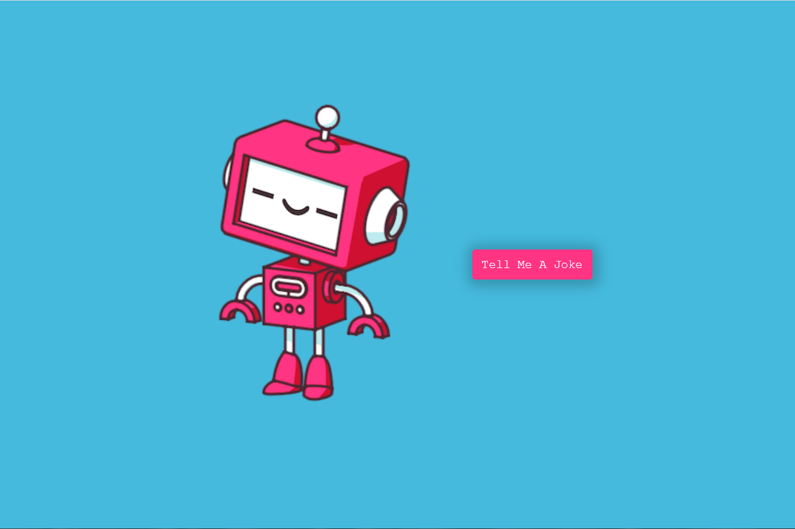

# Joke Teller

## About

A joke teller web app that functions like Siri and Cortana. It tells a joke out loud when the user makes a request. The app is integrated with a joke API to acquire a random joke and pass it to a text-to-speech API to make it sounded.

## Resource

- [Text-to-speech API](http://www.voicerss.org/api/)
- [JokeAPI](https://sv443.net/jokeapi/v2/)
